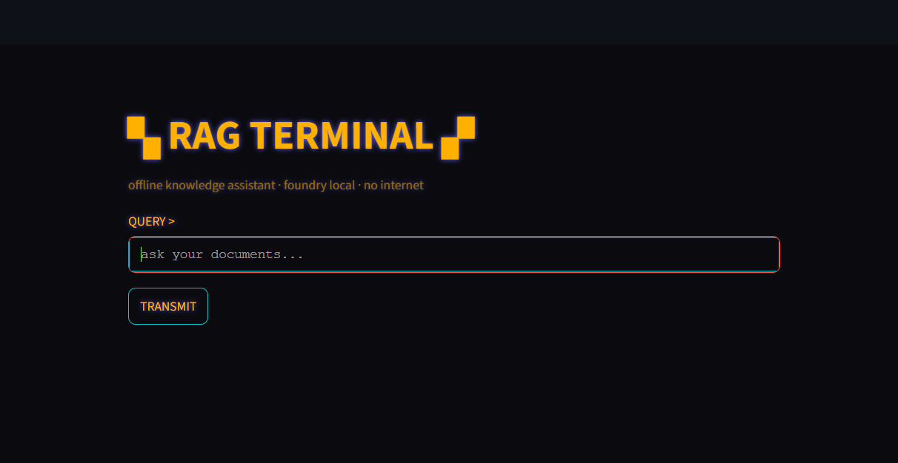
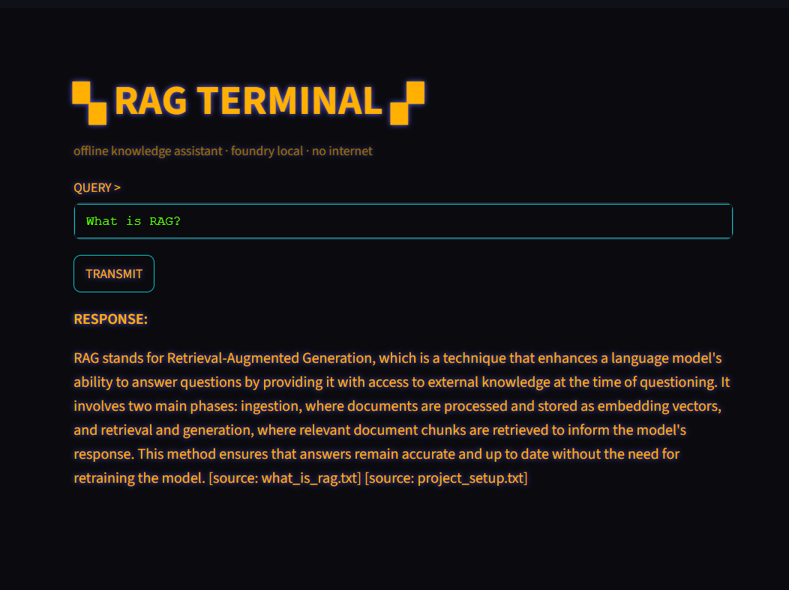
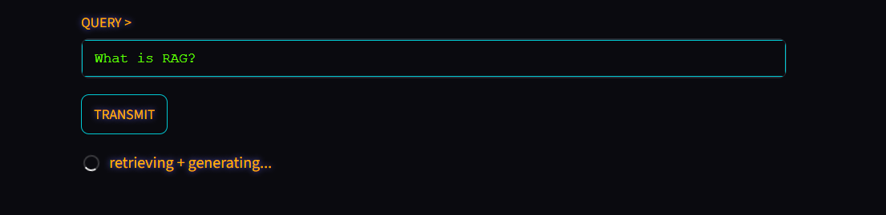
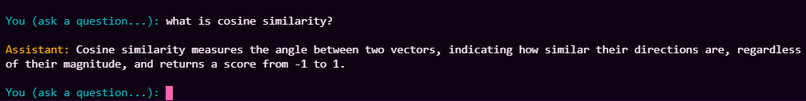
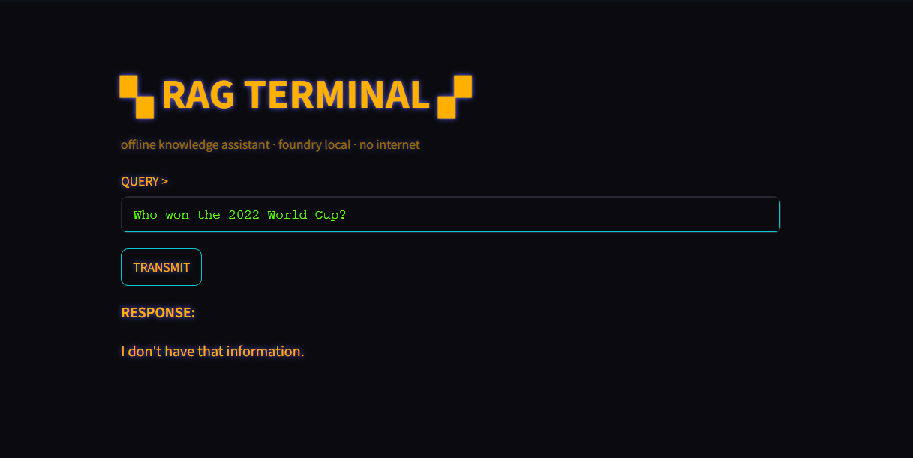

<div align="center">

# 🖥️ LOCAL RAG ASSISTANT

### *offline knowledge assistant · foundry local · no internet*

<p align="center">
  
  
  
  
  
</p>

Ask questions about your own documents and get grounded, sourced answers —
**no internet, no API keys, no data leaving your machine.**



</div>

---

## What it is

A minimal Retrieval-Augmented Generation (RAG) pipeline built in Python. You
drop `.txt` files into `data/docs/`, ingest them once, and then ask questions
through either a command-line REPL or a retro-terminal web UI. The assistant
retrieves the most relevant chunks of your documents, hands them to a local LLM
as context, and answers **only** from what it found — refusing with *"I don't
have that information."* when the answer isn't in your docs.

When a question **is** covered by your documents, it retrieves the relevant
chunks and answers from them — concise and grounded:

<div align="center">

</div>

---

## Architecture

Four layers, each isolated in its own module by responsibility:

```
          ┌─────────────────────────────────────────────┐
          │                 INTERFACE                    │
          │  main.py (CLI REPL)  ·  app.py (Streamlit)   │
          └───────────────────────┬─────────────────────┘
                                   │  question
                                   ▼
          ┌─────────────────────────────────────────────┐
          │                 GENERATION                   │
          │   generator.py — build prompt, call the LLM  │
          │            (Foundry Local · phi-4-mini)      │
          └───────────────────────┬─────────────────────┘
                                   │  needs context
                                   ▼
          ┌─────────────────────────────────────────────┐
          │                 RETRIEVAL                    │
          │   retriever.py — embed query, cosine-rank    │
          │                 top-K chunks                 │
          └───────────────────────┬─────────────────────┘
                                   │  reads vectors
                                   ▼
          ┌─────────────────────────────────────────────┐
          │                 INGESTION                    │
          │  ingest.py → chunking.py → embeddings.py →   │
          │             database.py (SQLite)             │
          └─────────────────────────────────────────────┘
```

| Layer | Files | Job |
|-------|-------|-----|
| **Ingestion** | `ingest.py`, `chunking.py`, `embeddings.py`, `database.py` | Split docs into chunks, embed them, store chunk + vector in SQLite |
| **Retrieval** | `retriever.py` | Embed the question, cosine-rank all chunks, return the top 3 |
| **Generation** | `generator.py` | Stuff retrieved context into a prompt, call the local LLM, stream the answer |
| **Interface** | `main.py`, `app.py` | CLI REPL and Streamlit web UI — two faces on the same engine |

---

## Setup

**Prerequisites:** Python 3.11+ and [Foundry Local](https://learn.microsoft.com/azure/ai-foundry/foundry-local/get-started)
installed and running.

```bash
# 1. clone
git clone https://github.com/sudenazfh/local-rag-assistant.git
cd local-rag-assistant

# 2. virtual environment
python -m venv .venv
.venv\Scripts\activate        # Windows
# source .venv/bin/activate   # macOS / Linux

# 3. dependencies
pip install -r requirements.txt
```

The active model (`phi-4-mini`) and embedding model (`all-MiniLM-L6-v2`) are
set in `src/config.py`.

---

## Usage

```bash
# 1. ingest your documents (one time, or whenever docs/ changes)
python -m src.ingest

# 2a. ask questions in the terminal
python -m src.main

# 2b. or launch the web UI
streamlit run src/app.py
```

Put your own `.txt` files in `data/docs/` before ingesting. The first question
is slow (the model loads into memory); every question after is fast — a spinner
shows while it retrieves and generates:

<div align="center">

</div>

> **Tip:** if Streamlit's file-watcher spams import warnings on startup, run
> `streamlit run src/app.py --server.fileWatcherType none`.

The command-line REPL (`python -m src.main`) is the same engine in an
amber/teal terminal:

<div align="center">

</div>

---

## How it works

1. **Ingest** — each document is split into ~800-character chunks along
   paragraph boundaries (`chunking.py`). Every chunk is turned into an embedding
   vector by `all-MiniLM-L6-v2` (`embeddings.py`) and stored, with its source
   filename, in a single SQLite file (`database.py`).
2. **Retrieve** — your question is embedded the same way. `retriever.py`
   computes cosine similarity between the question vector and every stored chunk
   vector, then returns the top 3 (`TOP_K`).
3. **Generate** — `generator.py` builds a prompt: a strict system instruction
   ("answer only from context, cite the source, refuse if unknown") plus the
   retrieved chunks and the question. The local LLM streams back a grounded
   answer.
4. **Answer** — the CLI or Streamlit UI displays it. When nothing relevant is
   found in your documents, the assistant refuses with *"I don't have that
   information."* instead of hallucinating an answer:

<div align="center">

</div>

See [`tests/TESTLOG.md`](tests/TESTLOG.md) for a functional evaluation across
in-docs, out-of-docs, and edge-case questions.

---

## Limitations & design choices

These are **deliberate** simplifications — the right amount of engineering for a
local, single-user assistant, not oversights:

- **Brute-force retrieval.** `retriever.py` scans *every* chunk with cosine
  similarity on each query — O(n). Perfectly fast for a few thousand chunks; a
  vector index (FAISS, sqlite-vec) would only be worth it at much larger scale.
- **Character-based chunking.** Chunks split on paragraphs up to a character
  budget, not tokens or semantic boundaries. Simple and good enough; token-aware
  splitting is the upgrade path if answer quality suffers.
- **Small local model.** Running a small model via Foundry Local keeps everything
  offline and laptop-friendly, at the cost of occasional verbosity — length
  instructions are a soft nudge, not a hard cap, on a model this size.
- **Plain-text corpus only.** Ingestion reads `.txt`. PDF/HTML parsing would be a
  pre-processing step, not a change to the pipeline.

---

<div align="center">
<sub>Built with Foundry Local · Blade Runner 2049 palette · 100% offline</sub>
</div>
